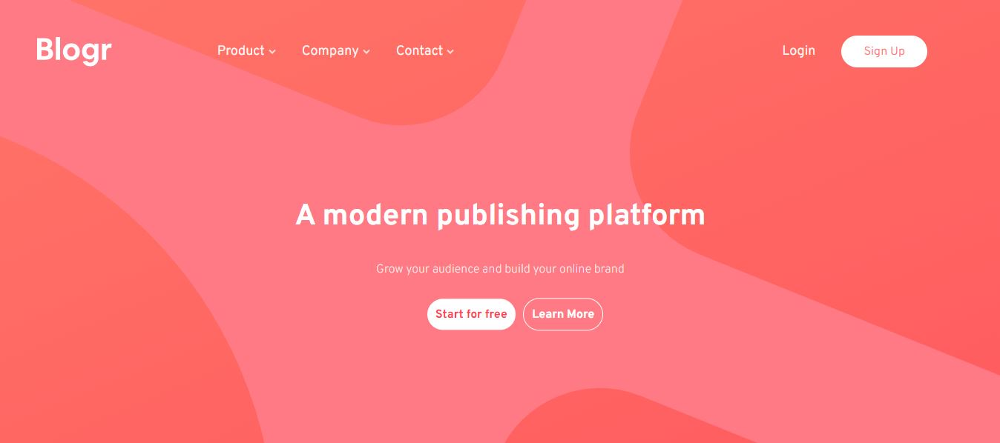

# Blogr Landing Page

This repository contains the solution for the Blogr Landing Page challenge from Frontend Mentor.

## Table of Contents

- [Overview](#overview)
- [Demo](#demo)
- [Features](#features)

## Overview

### The Challenge

The challenge was to create a landing page for Blogr that is responsive and includes hover states for all interactive elements.

### Screenshot

## Demo

You can view the live demo of the project [here](https://your-live-site-url.com).

## Features

- Responsive design for various screen sizes
- Hover states for interactive elements
- Clean and modern UI design

